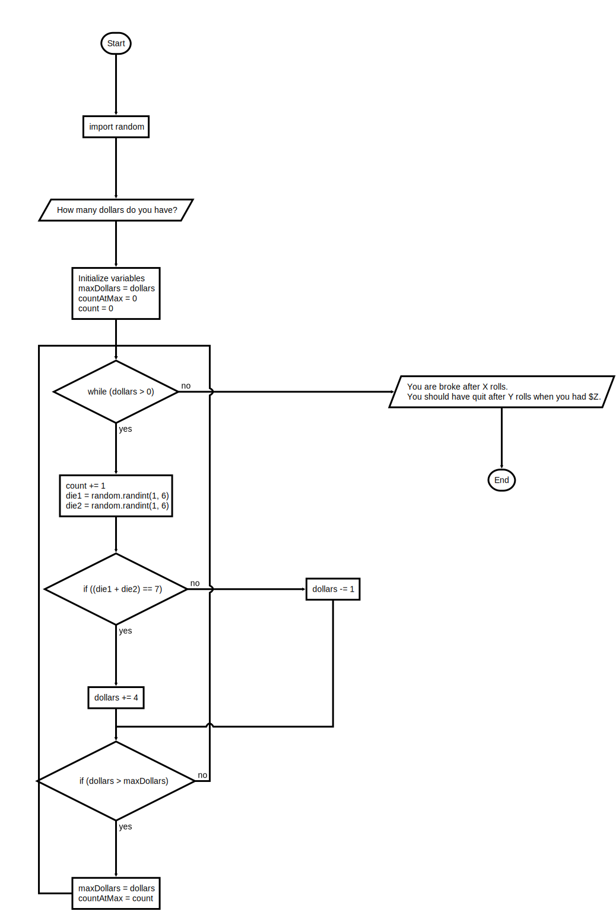

## Program: sevens.py

Instructions
In the game of Lucky Sevens, the player rolls a pair of dice. If the dots add up to 7, the player wins \$4; otherwise, the player loses \$1.

Suppose that, to entice the gullible, a casino tells players that there are lots of ways to win: (1, 6), (2, 5), and so on. A little mathematical analysis reveals that there are not enough ways to win to make the game worthwhile; however, because many people’s eyes glaze over at the first mention of mathematics, your challenge is to write a program that demonstrates the futility of playing the game.

Your program should take as input the amount of money that the player wants to put into the pot, and using a random number generator play the game until the pot is empty. At that point, the program should print:

1. The number of rolls it took to break the player
2. The maximum amount of money in the pot.

An example of the program input and output is shown below:

```text
How many dollars do you have? 50

You are broke after 220 rolls.
You should have quit after 6 rolls when you had $59.
```

>This program implements logic to create semi-random results. The example above is one in many possible scenarios.
---

### Flowchart



---

### Starter Code

```python
"""
Program: sevens.py
Project 3.11

Simulate the game of lucky sevens until all funds are depleted.

1) Rules:
       roll two dice
       if the sum equals 7, win $4, else lose $1
2) The input is:
       the amount of money the user is prepared to lose 
3) Computations:
       use a random number generator to simulate rolling the dice
       loop until the funds are depleted 
       count the number of rolls
       keep track of the maximum amount
4) The outputs are:
       the number of rolls it takes to deplete the funds
       the maximum amount 

"""
# import module 

# Request the input

# Initialize variables

# Loop until the money is gone

    # Roll the dice

    #Calculate the winnings or losses

    #If this is a new maximum, remember it


# Display the results
```
