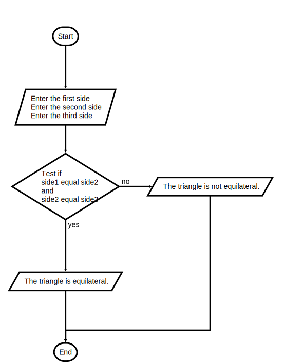

## Program: equilateral.py

### Instructions

Write a program that accepts the lengths of three sides of a triangle as inputs.

The program output should indicate whether or not the triangle is an equilateral triangle.

Use The triangle is equilateral. and The triangle is not equilateral. as your final outputs.
An example of the program inputs and output is shown below:

```text
Enter the first side: 2
Enter the second side: 2
Enter the third side: 2

The triangle is equilateral.
```

---

#### Flowchart



#### Starter Code

```python
"""
Program: equilateral.py
Project 3.1

Determine whether or not three input sides compose an
equilateral triangle.
"""

# Request the inputs


# Determine the result and display it

```


