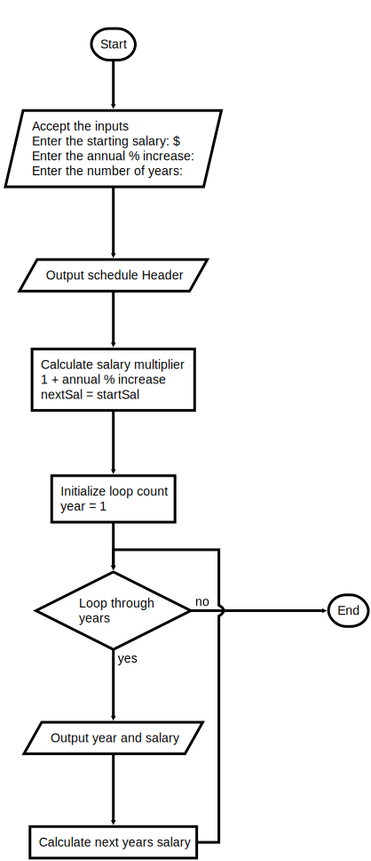

## Instructions

Teachers in most school districts are paid on a schedule that provides a salary based on their number of years of teaching experience.

For example, a beginning teacher in the Lexington School District might be paid $30,000 the first year. For each year of experience after this first year, up to 10 years, the teacher receives a 2% increase over the preceding value.

Write a program that displays a salary schedule, in tabular format, for teachers in a school district. The inputs are:

1. Starting salary
2. Annual percentage increase
3. Number of years for which to print the schedule

Each row in the schedule should contain the year number and the salary for that year

An example of the program input and output is shown below:

```text
Enter the starting salary: $30000
Enter the annual % increase: 2
Enter the number of years: 10

Year   Salary
-------------
 1    30000.00
 2    30600.00
 3    31212.00
 4    31836.24
 5    32472.96
 6    33122.42
 7    33784.87
 8    34460.57
 9    35149.78
10    35852.78
```

---

#### Flowchart



---

#### Starter Code

```python
"""
Program: salary.py
Project 3.7

Compute a school district's salary schedule.

Inputs 
   starting salary
   annual percentage increase
   number of years for which to print the schedule

Outputs
    Two columns containing the year and the salary
    after the increase.
"""

# Accept the inputs

# Output Header

# Compute and display the results

    # calculate next salary

```


