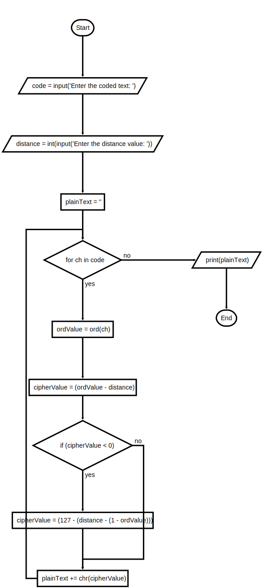

## Instructions

Write a script that inputs a line of encrypted text and a distance value and outputs plaintext using a Caesar cipher.

The script should work for any printable characters.

An example of the program input and output is shown below:

```text
Enter the coded text: Lipps${svph%
Enter the distance value: 4

Hello world!
```

---

### Flowchart



---

### Starter Code

```python
"""
File: decrypt.py
Project 4.2

Decrypts an input string characters and prints
the result.  The other input is the distance value.
"""

# The ASCII values range from 0 through 127
# Hint: ord('a') = 97 and ord('z') = 122

```

Image from textbook section 4-2 Data Encryption



