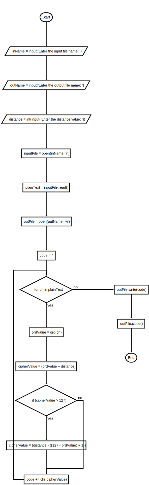
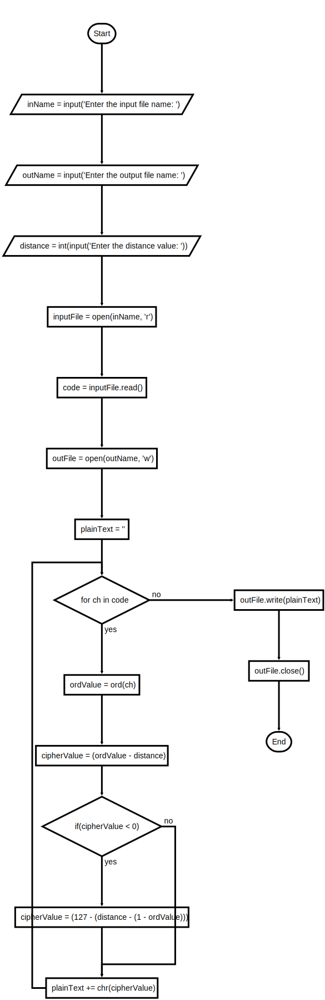

## Instructions

Modify the scripts of Projects 1 and 2 to encrypt and decrypt entire files of text.
An example of the program interface is shown below:

```text
Enter the input file name: encrypted.txt
Enter the output file name: a
Enter the distance value: 3
```

---

### Flowchart

#### Encrypt



#### Decrypt



---

### Starter Code

```python
"""
File: encrypt.py
Probject 4.1

Encypts an input string of the ASCII characters and prints
the result.  The other input is the distance value.
"""

# The ASCII values range from 0 through 127

plainText = input("Enter a message: ")
distance = int(input("Enter the distance value: "))
code = ""
for ch in plainText:
    ordValue = ord(ch)
    cipherValue = ordValue + distance
    if cipherValue > 127:
        cipherValue = distance - (127 - ordValue + 1)
    code +=  chr(cipherValue)
print(code)

```

```python
"""
File: decrypt.py
Project 4.2

Decrypts an input string characters and prints
the result.  The other input is the distance value.
"""

# The ASCII values range from 0 through 127

code = input("Enter the coded text: ")
distance = int(input("Enter the distance value: "))
plainText = ''
for ch in code:
    ordValue = ord(ch)
    cipherValue = ordValue - distance
    if cipherValue < 0:
        cipherValue = 127 - \
                      (distance - (1 - ordValue))
    plainText +=  chr(cipherValue)
print(plainText)

```


