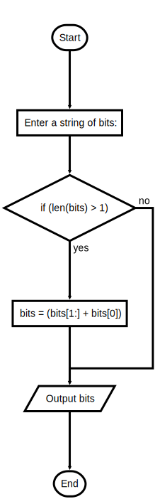
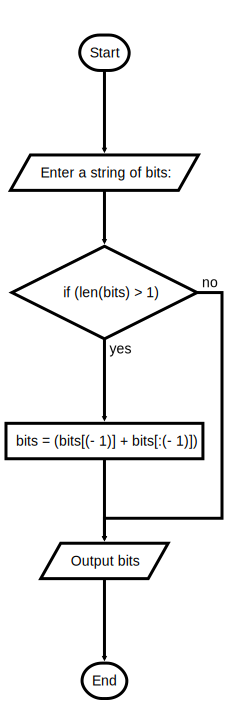

## Instruction

A bit shift is a procedure whereby the bits in a bit string are moved to the left or to the right.

For example, we can shift the bits in the string 1011 two places to the left to produce the string 1110. Note that the leftmost two bits are wrapped around to the right side of the string in this operation.

Define two scripts, shiftLeft.py and shiftRight.py, that expect a bit string as an input.

The script shiftLeft shifts the bits in its input one place to the left, wrapping the leftmost bit to the rightmost position.
The script shiftRight performs the inverse operation.

Each script prints the resulting string.

An example of shiftLeft.py input and output is shown below:

```text
Enter a string of bits: Hello world!

ello world!H
```

An example of shiftRight.py input and output is shown below:

```text
Enter a string of bits: Hello world!

!Hello world
```

### FlowChart

#### Shift Left



#### Shift Right



### Starter Code

```python
"""
File: shiftleft.py
Project 4.5

Shifts the bits in an input string one place to the left.
The leftmost bit wraps around to the rightmost position.
"""

```

```python
"""
File: shiftright.py
Project 4.5

Shifts the bits in an input string one place to the right.
The rightmost bit wraps around to the leftmost position.
"""

```


